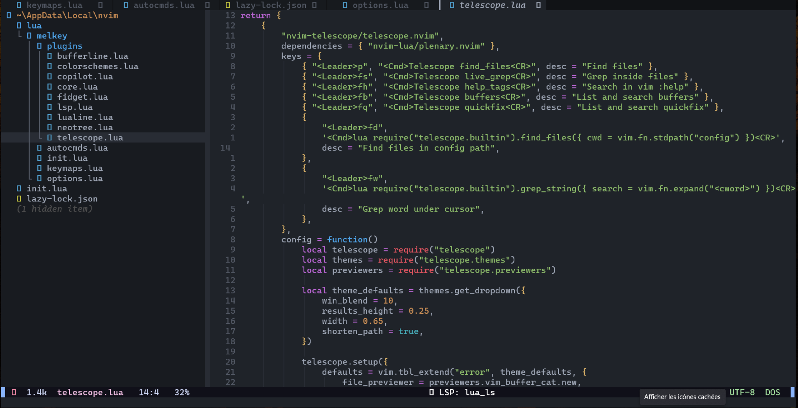

Here's my Neovim configuration.

Working on Neovim configurations takes a lot of time, but also (I admit) a lot of patience. To avoid spending a whole day working on the editor's configurations,
i used [melkey's configurations](https://github.com/Melkeydev/NvimConfig), which largely satisfied me.

Cette configuration est accompagne du manageur de plugins [Lazy.nvim](https://github.com/folke/lazy.nvim).

## How to download and configure

To download the configurations, create a nvim folder in the AppData folder, then download the repository:

`git clone https:///https://github.com/Dar-rius/nvim.git`

Once the download is complete, open the editor by typing `nvim`.

When the editor opens, lazy.nvim will install all plugins.
